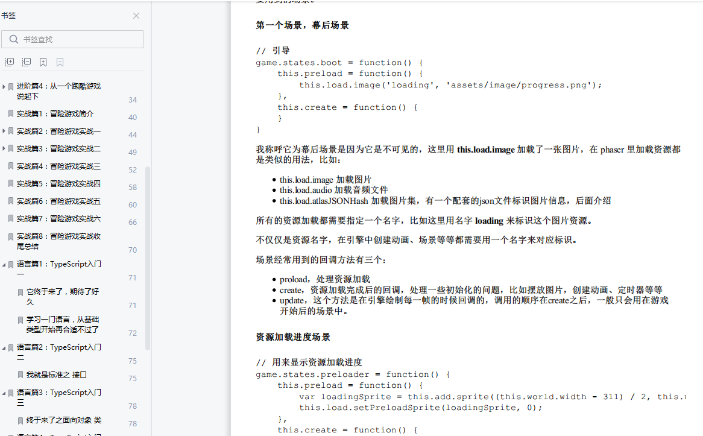
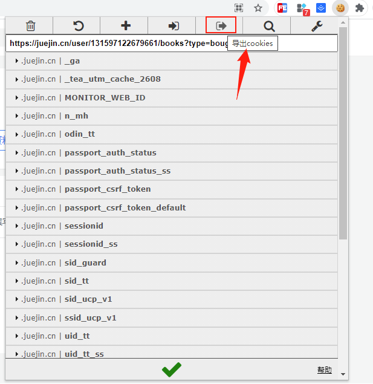

## 申明
不得滥用，不得用于谋利！  
不得滥用，不得用于谋利！   
不得滥用，不得用于谋利！

## 功能介绍
自己已购买的小册，自己已购买的小册。
把掘金**booklet**内容下载到本地，并生成pdf文件。

生成的pdf功能支持：
1. 大纲目录
2. 代码高亮
3. 文章图片
4. 链接点击

其他：
1. 支持自定义pdf显示的样式

## 效果预览




## 思路


1. 下载JSON格式的数据到本地
2. 把markdown语法的文章内容转为html格式，并生成html文件
3. 借助`wkhtmltopdf.exe`生成pdf文件


## 开发环境
1.  windows 10
2.  Python 3.9.1

## 使用

请注意运行环境 windows以及Python版本

1. 下载 [wkhtmltopdf](https://wkhtmltopdf.org/), 并配置环境变量
2. chrome打开，登录掘金网站
3. 安装 `EditThisCookie` chrome插件
   复制cookie，贴到`cookie.json`文件，可反复使用。
    
4. 执行命令 
bid: 小册ID
```python   
python main.py [bid] 

```
示例: 注意引用
```python
python main.py 6901095904892321800
```

如果是下载某个用户的所有小册, 后面再追加一个固定参数 `u`
示例：
```python
python main.py 131597122679661 u
```


## 已知问题
1. 中文路径问题
    那就使用英文路径吧，文件名是中文没问题


### 参考引用

[python+markdown+Pygments高亮代码](https://blog.csdn.net/JONE_WUQINGJIANG/article/details/100511760)
